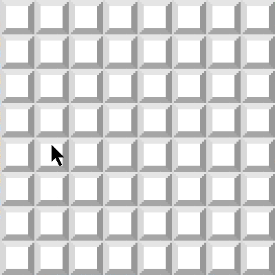

# Minesweeper

A minesweeper game coded in Java. Looks a lot like the original. Art by me! What's great about making this game is it has a recursive [Flood fill](https://en.wikipedia.org/wiki/Flood_fill) algorithm. Good practice and makes it fun too!

Instructions:

* Press the 'r' key to restart anytime.
* Left click to dig.
* Right click to flag.
* Don't dig up a mine.
* Uncover all the land and flag all the mines.
* Have fun.

You can make it as big or small as you want by changing the following lines of code:

```java
private final int CELL_SIZE = 50;
private final int GRID_WIDTH = 8;
private final int GRID_HEIGHT = 8;
```
Where : 
* *CELL_SIZE* is simply the size of a single block in pixels.
* *GRID_WIDTH* & *GRID_HEIGHT* are the grid dimensions. For example, the above code makes a 8x8 Minesweeper game.
___

Quick dive into the code:
* *__GameManager.java__*: This class handles the input and drawing.
* *__MinesweeperBoard.java__*: This class handles all the Minesweeper game logic. Inside this class there is the *__Cell__* class. This short class contains the information on a single cell or patch of land:
    ```java
    public boolean isCovered = true; // if it is clicked
	public boolean isFlagged = false; // if it is flagged
	public boolean isMine = false; // if it is a mine
	public int nMine = 0; // the number of neighboring mines
    ```
    A list of these *Cells* is in the *MinesweeperBoard* class.

___

Here's what it looks like:


